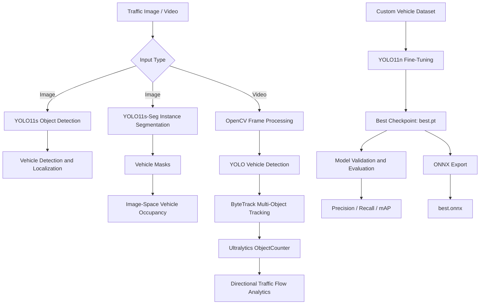

# Smart Traffic Analytics with YOLO11

**Author:** Shaikha Alkhathlan

An end-to-end computer vision system for traffic monitoring using **Ultralytics YOLO11**, combining vehicle detection, instance segmentation, multi-object tracking, traffic-flow analytics, custom model fine-tuning, quantitative evaluation, and ONNX deployment.

## Overview

The system analyzes traffic images and video to identify vehicles, estimate image-space vehicle occupancy, track vehicles across frames, and count directional vehicle crossings.

The project also implements a complete custom model development workflow by fine-tuning YOLO11 on a vehicle-specific dataset, evaluating the trained model using standard object-detection metrics, and exporting the best checkpoint to ONNX.

## System Architecture



## Core Capabilities

### Vehicle Detection

A pretrained **YOLO11s** model detects and localizes vehicles in traffic scenes, providing vehicle classes, confidence scores, and bounding boxes.

### Instance Segmentation

**YOLO11s-Seg** generates pixel-level masks for detected vehicles. These masks are used to estimate **image-space vehicle occupancy**, providing a more precise representation of the visible area occupied by vehicles than bounding boxes alone.

### Traffic Tracking and Counting

Traffic video is processed frame-by-frame using **OpenCV**.

YOLO detects vehicles, while **ByteTrack** maintains vehicle identities across consecutive frames. Ultralytics **ObjectCounter** then records directional vehicle crossings through a defined monitoring region.

This allows the application to analyze traffic movement rather than repeatedly counting the same vehicle in every frame.

## Technical Components

| Component | Technology | Purpose |
|---|---|---|
| Object Detection | YOLO11s | Vehicle detection and localization |
| Instance Segmentation | YOLO11s-Seg | Vehicle masks and occupancy analysis |
| Custom Detector | YOLO11n | Fine-tuned vehicle detection |
| Multi-Object Tracking | ByteTrack | Maintains vehicle identities across frames |
| Traffic Counting | Ultralytics ObjectCounter | Directional vehicle crossing analysis |
| Video Processing | OpenCV | Frame capture, processing, and output |
| Dataset | Roboflow | Custom labeled vehicle dataset |
| Deployment | ONNX | Portable model representation |

## Dataset

The custom detector was trained using a **vehicle detection dataset from Roboflow Universe** containing **1,000 annotated traffic images**.

The dataset contains four vehicle classes:

`car` · `bus` · `truck` · `motorbike`

| Split | Images |
|---|---:|
| Training | 800 |
| Validation | 100 |
| Test | 100 |
| **Total** | **1,000** |

The dataset is downloaded in **YOLO11 format** and configured through its `data.yaml` file.

## Model Fine-Tuning

A pretrained **YOLO11n** model was fine-tuned on the custom vehicle dataset using transfer learning.

### Training Configuration

| Parameter | Value |
|---|---|
| Model | YOLO11n |
| Epochs | 15 |
| Image Size | 640 × 640 |
| Batch Size | 16 |
| Early-Stopping Patience | 5 |
| Pretrained Weights | Enabled |
| Data Augmentation | Enabled |

The best-performing checkpoint generated during training is stored as `best.pt` and used for evaluation and deployment.

## Model Evaluation

The best fine-tuned model was evaluated using Ultralytics `model.val()` on **100 validation images containing 1,107 labeled vehicle instances**.

| Metric | Result |
|---|---:|
| Precision | **0.894** |
| Recall | **0.835** |
| mAP50 | **0.902** |
| mAP50–95 | **0.710** |

The results demonstrate strong overall vehicle-detection performance.

The **motorbike** class was the most challenging, particularly for recall and stricter bounding-box localization.

## Traffic Analytics Results

The traffic video pipeline combines YOLO detection, ByteTrack tracking, OpenCV processing, and ObjectCounter.

| Vehicle Class | IN | OUT | Total |
|---|---:|---:|---:|
| Car | 13 | 3 | 16 |
| Truck | 2 | 0 | 2 |
| **Total** | **15** | **3** | **18** |

The analyzed video produced **18 tracked vehicle crossing events**.

Instance segmentation also produced an estimated **7.92% image-space vehicle occupancy** for the analyzed traffic scene.

> Traffic counts represent model-generated crossing events rather than manually verified ground-truth traffic volume. Image-space occupancy represents the visible proportion of the image occupied by vehicle masks and is not equivalent to physical road occupancy.

## Deployment

The best fine-tuned checkpoint was successfully exported from PyTorch to **ONNX** using the Ultralytics export API.

```text
best.pt → best.onnx
```

ONNX provides a portable model representation that can be integrated with different inference runtimes and deployment environments.

## Getting Started

### Prerequisites

- Python 3
- Google Colab or a compatible Python environment
- GPU recommended for model training
- Roboflow API key

### Installation

Install the required dependencies:

```bash
pip install ultralytics roboflow opencv-python
```

### Roboflow Configuration

The Roboflow API key is **not hard-coded or stored in the repository**.

In Google Colab, create a secret named:

```text
ROBOFLOW_API_KEY
```

The notebook retrieves the credential securely using:

```python
from google.colab import userdata

ROBOFLOW_API_KEY = userdata.get("ROBOFLOW_API_KEY")
```

### Execution

1. Open `CVD_Smart_Traffic_Analytics_YOLO11.ipynb` in Google Colab.
2. Enable a GPU runtime if available.
3. Add `ROBOFLOW_API_KEY` to Colab Secrets and enable notebook access.
4. Run the notebook cells sequentially.

The notebook executes the complete workflow:

```text
Inference → Segmentation → Video Analytics → Fine-Tuning → Evaluation → ONNX Export
```

## Repository Structure

```text
CVD_Smart_Traffic_Analytics_YOLO11/
├── README.md
├── CVD_Smart_Traffic_Analytics_YOLO11.ipynb
└── .gitignore
```

Datasets, generated training runs, model artifacts, credentials, and temporary files are excluded from version control.

## Limitations

Performance can be affected by:

- Small and distant vehicles
- Partial vehicle occlusion
- Perspective effects
- Tracking interruptions
- Counting-region placement

Motorbikes showed the weakest class-specific validation performance. Traffic-flow measurements also depend on successful detection and tracking throughout each vehicle's trajectory.

## Program Attribution

This project was developed as the capstone project for the **Computer Vision for Developers** training program.

**Session:** 9–13 August 2026

The project applies concepts covered throughout the program, including Ultralytics YOLO inference, computer vision tasks, real-world video analytics, custom model training, quantitative evaluation, and model deployment.

### References

- [Computer Vision for Developers — Course Materials](https://naifmersal.github.io/cv-for-developers-ultralytics/)
- [SDAIA Academy — GitHub](https://github.com/SDAIAAcademy)

## Acknowledgments

Special thanks to **SDAIA Academy** and the program instructors for providing the training, technical guidance, and learning resources that supported the development of this project.
